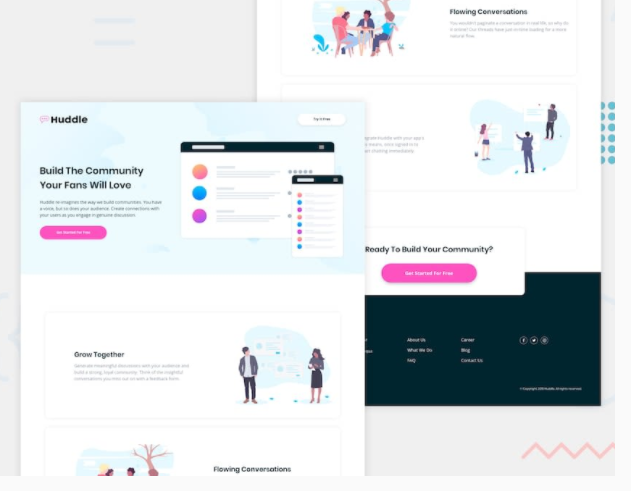

<h2>Huddle landing page with alternating feature Blocks </h2>

This is my solution to <strong>Testimonial grid section</strong> challenge by Frontendmentor.io. Frontendmentor help us to improve our skills by building realistic projects.

<h3>Live Link</h3>
<a href="https://sonakshirawat.github.io/huddle-landing-page/">Click here</a>

<h3>Screenshots</h3>

<h3>My Process</h3>
I started by writing down the markup using HTML5 language. Then using CSS3 properties like flexbox , desktop design was created. After that using dev chrome tools the card was made responsive.

<h3>Build Using</h3>
<ul>
  <li>HTML5 Markup language</li>
  <li>CSS3 Custom Properties</li>
</ul>